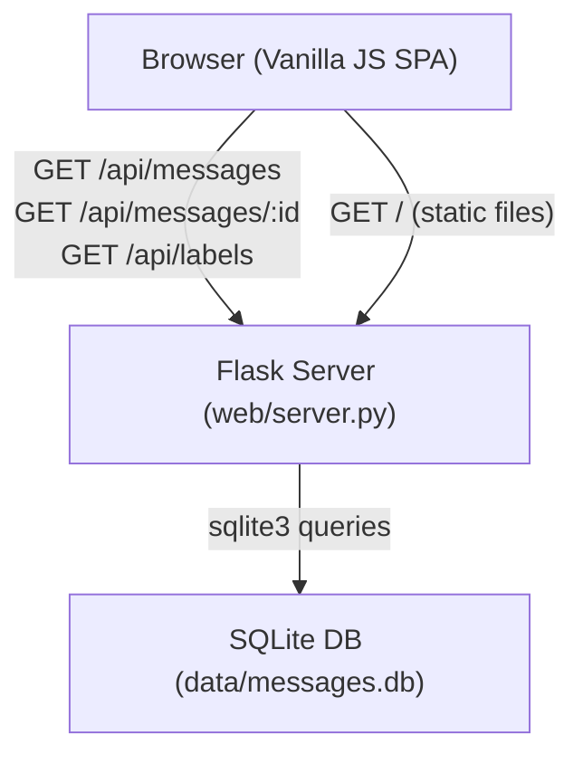

# Design Document: Gmail Web Viewer

## Overview

A minimal Single Page Application (SPA) for browsing Gmail messages stored in a local SQLite database. The system consists of two parts:

1. **Python backend** — a lightweight Flask server that reads from `data/messages.db` and exposes a REST JSON API.
2. **Vanilla JS frontend** — a static SPA served by the same Flask process that renders a paginated message list, search/filter controls, and a message detail view.

All new code lives under `web/` at the workspace root. The backend is started with a single command and requires no external services beyond the existing SQLite database.

### Goals

- Zero new infrastructure — query the existing `messages` table directly via Python's built-in `sqlite3` module; no dependency on root package code.
- Single process — Flask serves both the API and the static files.
- Self-contained under `web/` — all new Python, JS, CSS, and test files live exclusively under `web/`; nothing in the workspace root is created or modified.
- Minimal dependencies — Flask (+ flask-cors for dev convenience) declared in `web/requirements.txt`; no JS build step.

---

## Architecture



The Flask process:
- Serves `web/static/index.html` (and associated CSS/JS) at `/`.
- Exposes REST endpoints under `/api/`.
- Reads the database path from a CLI argument (`--db-path`, default `data/messages.db`).
- Exits with a non-zero code if the database file does not exist at startup.

---

## Components and Interfaces

### Backend Components

#### `web/server.py` — Flask application entry point

Responsibilities:
- Parse CLI arguments (`--port`, `--db-path`).
- Validate that the DB file exists; exit with error if not.
- Open a `sqlite3` connection and store the DB path in Flask app config for use by blueprints.
- Register API blueprints and static file route.
- Start the Flask development server.

#### `web/db.py` — Database helper

Responsibilities:
- Provide `get_db()` — returns a `sqlite3.Connection` configured with `row_factory = sqlite3.Row` and `detect_types = PARSE_DECLTYPES`.
- Provide `close_db()` — closes the connection after each request via Flask's `teardown_appcontext`.
- All SQL queries use parameterised statements; no raw string interpolation.

#### `web/api/messages.py` — Messages blueprint

Registers routes:
- `GET /api/messages` — list with pagination, search, and filters.
- `GET /api/messages/<message_id>` — single message detail.

#### `web/api/labels.py` — Labels blueprint

Registers routes:
- `GET /api/labels` — distinct label list.

#### `web/api/__init__.py` — Blueprint registration helper

### Frontend Components (under `web/static/`)

| File | Responsibility |
|---|---|
| `index.html` | Shell HTML; imports CSS and JS |
| `app.js` | App bootstrap, state management, event wiring |
| `api.js` | `fetch` wrappers for all API calls |
| `messageList.js` | Renders the message table and pagination controls |
| `messageDetail.js` | Renders the detail panel/modal |
| `filters.js` | Renders search input and label dropdown |
| `style.css` | Minimal styling |

### REST API Interface

#### `GET /api/messages`

Query parameters:

| Parameter | Type | Default | Notes |
|---|---|---|---|
| `page` | int | 1 | Must be ≥ 1 |
| `page_size` | int | 50 | 1–200 |
| `q` | string | — | Case-insensitive substring match on subject, sender, body |
| `label` | string | — | Exact match within labels JSON array |
| `is_read` | bool | — | `true` / `false` |
| `is_outgoing` | bool | — | `true` / `false` |
| `include_deleted` | bool | false | Include `is_deleted=true` records |

Response envelope:

```json
{
  "messages": [ /* array of message summary objects */ ],
  "total": 1234,
  "page": 1,
  "page_size": 50
}
```

Message summary object fields: `message_id`, `thread_id`, `sender`, `labels`, `subject`, `timestamp`, `is_read`, `is_outgoing`, `is_deleted`.

Error responses: HTTP 400 for invalid parameters, HTTP 500 for DB errors.

#### `GET /api/messages/<message_id>`

Returns the full message record (all summary fields + `recipients`, `body`).

Error: HTTP 404 `{"error": "Message not found"}` if not found.

#### `GET /api/labels`

Returns a JSON array of distinct label strings, sorted alphabetically, from non-deleted messages.

```json
["INBOX", "SENT", "Work", ...]
```

---

## Data Models

### Existing Database Schema (read-only)

The backend reads from the existing `messages` table in `data/messages.db` via `sqlite3`. No schema changes are required.

| Column | Type | Notes |
|---|---|---|
| `message_id` | TEXT | Primary key |
| `thread_id` | TEXT | |
| `sender` | JSON | `{"name": "...", "email": "..."}` |
| `recipients` | JSON | `{"to": [...], "cc": [...], "bcc": [...]}` |
| `labels` | JSON | Array of label strings |
| `subject` | TEXT | Nullable |
| `body` | TEXT | Nullable; plain text |
| `size` | INTEGER | |
| `timestamp` | DATETIME | |
| `is_read` | BOOLEAN | |
| `is_outgoing` | BOOLEAN | |
| `is_deleted` | BOOLEAN | |
| `last_indexed` | DATETIME | |

### API Response Types (Python TypedDicts / JSON shapes)

```python
# Summary — returned by GET /api/messages
MessageSummary = {
    "message_id": str,
    "thread_id": str,
    "sender": {"name": str, "email": str},
    "labels": list[str],
    "subject": str | None,
    "timestamp": str,   # ISO-8601
    "is_read": bool,
    "is_outgoing": bool,
    "is_deleted": bool,
}

# Detail — returned by GET /api/messages/<id>
MessageDetail = MessageSummary | {
    "recipients": {"to": [...], "cc": [...], "bcc": [...]},
    "body": str | None,
}

# List envelope
MessageListResponse = {
    "messages": list[MessageSummary],
    "total": int,
    "page": int,
    "page_size": int,
}
```

### Frontend State Shape

```js
// app.js global state
state = {
  messages: [],       // current page of MessageSummary objects
  total: 0,
  page: 1,
  pageSize: 50,
  query: "",
  label: "",
  isRead: null,       // null | true | false
  isOutgoing: null,
  includeDeleted: false,
  selectedMessage: null,  // MessageDetail | null
  labels: [],         // all available labels
  error: null,
}
```

---

## Correctness Properties

*A property is a characteristic or behavior that should hold true across all valid executions of a system — essentially, a formal statement about what the system should do. Properties serve as the bridge between human-readable specifications and machine-verifiable correctness guarantees.*

### Property 1: Pagination total consistency

*For any* combination of filter parameters, the `total` field in the response SHALL equal the count of all matching records, regardless of `page` or `page_size`.

**Validates: Requirements 2.5**

### Property 2: Page size bounds

*For any* valid request, the number of messages returned in the `messages` array SHALL be at most `page_size` and at most `total`.

**Validates: Requirements 2.2**

### Property 3: Search filter soundness

*For any* non-empty search query `q`, every message in the returned `messages` array SHALL contain `q` (case-insensitively) in at least one of: `subject`, `sender.name`, `sender.email`, or `body`.

**Validates: Requirements 3.1**

### Property 4: Label filter soundness

*For any* label filter value, every message in the returned `messages` array SHALL have that label present in its `labels` array.

**Validates: Requirements 3.2**

### Property 5: Boolean filter soundness

*For any* boolean filter (`is_read` or `is_outgoing`) applied to a request, every message in the returned `messages` array SHALL have the corresponding field equal to the requested boolean value.

**Validates: Requirements 3.3, 3.4**

### Property 6: Deleted messages excluded by default

*For any* request that does not include `include_deleted=true`, no message in the returned `messages` array SHALL have `is_deleted` equal to `true`.

**Validates: Requirements 6.1**

### Property 7: Labels endpoint completeness

*For any* label `L` that appears in the `labels` field of at least one non-deleted message, `L` SHALL appear in the response of `GET /api/labels`, and the full response SHALL be sorted alphabetically.

**Validates: Requirements 5.1**

### Property 8: Invalid pagination parameters rejected

*For any* value of `page` or `page_size` that is not a positive integer (e.g., zero, negative, non-numeric string), the API SHALL return HTTP 400 with a JSON error body.

**Validates: Requirements 7.3**

---

## Error Handling

### Backend

| Scenario | HTTP Status | Response Body |
|---|---|---|
| `page` or `page_size` not a valid positive integer | 400 | `{"error": "<description>"}` |
| `message_id` not found | 404 | `{"error": "Message not found"}` |
| Database query exception | 500 | `{"error": "<description>"}` (exception logged to stderr) |
| DB file missing at startup | — | Process exits with non-zero code; descriptive message printed to stderr |

All API error responses use `Content-Type: application/json`.

### Frontend

- On any non-2xx response, the SPA extracts the `error` field from the JSON body (or falls back to the HTTP status text) and renders it in a visible error banner inside the main content area.
- The error banner is cleared on the next successful fetch.
- Network failures (no response) show a generic "Network error — please check the server is running" message.

---

## Testing Strategy

### Unit Tests (pytest)

Located in `web/tests/test_web_*.py`. Cover:

- **Parameter validation**: invalid `page`, `page_size`, boolean coercion for `is_read` / `is_outgoing` / `include_deleted`.
- **Query building**: each filter applied in isolation and in combination produces the correct SQL WHERE clause (tested against an in-memory SQLite DB seeded with fixture data).
- **Serialization**: `MessageSummary` and `MessageDetail` dicts contain all required fields and correct types.
- **Labels endpoint**: returns only distinct labels from non-deleted messages, sorted alphabetically.
- **404 handling**: requesting a non-existent `message_id` returns 404 with the correct JSON body.
- **500 handling**: a simulated DB exception returns 500 with a JSON error body.

### Property-Based Tests (pytest + Hypothesis)

Each property test runs a minimum of 100 iterations via Hypothesis `@given` strategies.

Tests are tagged with comments in the format:
`# Feature: gmail-web-viewer, Property <N>: <property_text>`

| Property | Test description |
|---|---|
| Property 1 | Generate random filter combos; assert `total` equals full count query |
| Property 2 | Generate random `page`/`page_size`; assert `len(messages) <= page_size` and `<= total` |
| Property 3 | Generate random query strings and message sets; assert every returned message contains the query in subject/sender/body |
| Property 4 | Generate random label strings and message sets; assert every returned message has that label |
| Property 5 | Generate random boolean filter values (`is_read`, `is_outgoing`) and message sets; assert all returned messages match the filter |
| Property 6 | Generate random message sets with mixed `is_deleted` values; assert no returned message has `is_deleted=True` without the flag |
| Property 7 | Generate random message sets; assert every label from non-deleted messages appears in `/api/labels` and the list is sorted |
| Property 8 | Generate invalid `page`/`page_size` values (zero, negative, non-numeric); assert HTTP 400 is returned |

All property tests use an in-memory SQLite database seeded by Hypothesis strategies — no real `data/messages.db` is touched.

### Integration / Smoke Tests

- Start the Flask test client with a real (temp-copy) SQLite DB and verify end-to-end responses for the happy path of each endpoint.
- Verify the server exits with a non-zero code when the DB file does not exist.
