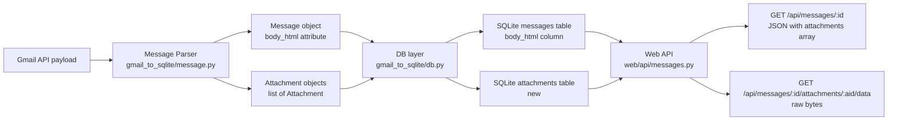

# Design Document: raw-body-storage

## Overview

This feature extends the gmail-to-sqlite pipeline in two related ways:

1. **HTML body storage** — preserve the raw HTML body of each Gmail message in a new `body_html` column on the `messages` table, so that the web viewer can render rich email content.
2. **Attachment storage** — extract attachment metadata and binary data from multipart Gmail payloads and persist them in a new `attachments` table, with a web API endpoint to retrieve attachment data.

Both changes are deliberately additive and backward-compatible. The existing `body` plain-text field and all existing behaviour are left unchanged. `body_html` is nullable so plain-text-only emails continue to be stored without error. Attachment data is nullable to accommodate large attachments that must be fetched separately via the Gmail API.

## Architecture

The feature touches four layers in sequence:



The migration runner (`gmail_to_sqlite/migrations.py`) is invoked at startup:
- v1 (version 0 → 1): adds `is_deleted` column to `messages`
- v2 (version 1 → 2): adds `body_html` column to `messages`
- v3 (version 2 → 3): creates the `attachments` table

## Components and Interfaces

### 1. Message Parser (`gmail_to_sqlite/message.py`)

#### body_html (existing)

**Attribute on `Message`:**
```python
self.body_html: Optional[str] = None
```

**`_extract_html_body(payload: Dict) -> Optional[str]`** — walks the payload for a `text/html` part, decodes it from base64url, and returns the string. Returns `None` on absence or decoding failure.

**`_extract_body(payload: Dict)`** — calls `_extract_html_body` and assigns the result to `self.body_html`, then continues with the existing plain-text extraction logic.

#### Attachments (new)

**New `Attachment` dataclass** (defined in `message.py`):
```python
@dataclass
class Attachment:
    filename: Optional[str]       # from Content-Disposition or part headers
    mime_type: str                 # e.g. "application/pdf"
    size: int                      # bytes
    data: Optional[bytes]          # decoded attachment content (None for large attachments)
    attachment_id: Optional[str]   # Gmail attachment ID for large attachments
```

**New attribute on `Message`:**
```python
self.attachments: List[Attachment] = []
```

**New helper `_extract_attachments(payload: Dict) -> List[Attachment]`** — walks the multipart payload and collects attachment parts:

- Skip `text/plain` and `text/html` parts (those are body parts, not attachments).
- For each remaining part, extract:
  - `filename`: from the `Content-Disposition` header's `filename` parameter first; fall back to the `name` parameter in the `Content-Type` header; fall back to `None`.
  - `mime_type`: from `part["mimeType"]`.
  - `size`: from `part["body"]["size"]` (0 if absent).
  - `data`: decode `part["body"]["data"]` with `base64.urlsafe_b64decode` if present; `None` if absent (large attachment) or if decoding fails.
  - `attachment_id`: from `part["body"]["attachmentId"]` if present; `None` otherwise.
- Non-multipart payloads return an empty list.
- Any per-part decoding failure sets `data = None` for that part and continues — never propagates.

**Updated `_extract_body`** — after existing logic, calls `self.attachments = self._extract_attachments(payload)`.

### 2. Database Layer (`gmail_to_sqlite/db.py`)

#### body_html (existing)

```python
# On Message model
body_html = TextField(null=True)
```

`create_message` inserts and upserts `body_html`.

#### Attachments (new)

**New `Attachment` model:**
```python
class Attachment(Model):
    id = AutoField()                          # auto PK
    message_id = ForeignKeyField(Message,
                    backref="attachments",
                    column_name="message_id",
                    field="message_id")       # FK → messages.message_id
    filename = TextField(null=True)
    mime_type = TextField()
    size = IntegerField(default=0)
    data = BlobField(null=True)               # raw bytes; NULL for large attachments
    attachment_id = TextField(null=True)      # Gmail attachment ID

    class Meta:
        database = database_proxy
        table_name = "attachments"
```

**New `create_attachments(message_id: str, attachments: List[AttachmentData]) -> None`** function:
- Deletes existing attachment rows for `message_id` (idempotent re-sync).
- Bulk-inserts new rows.
- Raises `DatabaseError` on failure.

**Updated `create_message`** — after the existing upsert, calls `create_attachments(msg.id, msg.attachments)`.

**Updated `db.init`** — adds `Attachment` to `db.create_tables([Message, SchemaVersion, Attachment])`.

### 3. Schema Migration (`gmail_to_sqlite/schema_migrations/`)

#### v2 — body_html column (existing)

`v2_add_body_html_column.py` — adds nullable `TextField` `body_html` to `messages`. Follows the same pattern as v1.

#### v3 — attachments table (new)

`v3_create_attachments_table.py`:

- Check whether the `attachments` table already exists via `table_exists("attachments")`.
- If it does, return `True` immediately (idempotent).
- Otherwise, execute:
  ```sql
  CREATE TABLE attachments (
      id INTEGER PRIMARY KEY AUTOINCREMENT,
      message_id TEXT NOT NULL REFERENCES messages(message_id),
      filename TEXT,
      mime_type TEXT NOT NULL,
      size INTEGER NOT NULL DEFAULT 0,
      data BLOB,
      attachment_id TEXT
  )
  ```
- Return `True` on success, `False` on any exception (logging the error).

**Updated `run_migrations` in `gmail_to_sqlite/migrations.py`:**
```python
if current_version == 0:
    # run v1 → set version 1
if current_version == 1:
    # run v2 → set version 2
if current_version == 2:
    from .schema_migrations.v3_create_attachments_table import run
    if run():
        set_schema_version(3)
    else:
        return False
```

A new `table_exists(table_name: str) -> bool` helper is added to `migrations.py` (mirrors `column_exists`).

### 4. Web API (`web/api/messages.py`)

#### body_html (existing)

`DETAIL_FIELDS` includes `"body_html"`. Absent from `SUMMARY_FIELDS`.

#### Attachments (new)

**Updated `get_message` endpoint** — after fetching the message row, queries the `attachments` table for all rows with matching `message_id` and appends an `attachments` array to the response:

```python
attachment_rows = db.execute(
    "SELECT filename, mime_type, size, attachment_id FROM attachments WHERE message_id = ?",
    (message_id,)
).fetchall()
attachments = [
    {
        "filename": row["filename"],
        "mime_type": row["mime_type"],
        "size": row["size"],
        "attachment_id": row["attachment_id"],
    }
    for row in attachment_rows
]
# merge into response dict
msg_dict["attachments"] = attachments
```

Note: `data` is intentionally excluded from this response to avoid large payloads.

**New endpoint `GET /api/messages/<message_id>/attachments/<attachment_id>/data`:**

```python
@messages_bp.route("/messages/<message_id>/attachments/<attachment_id>/data")
def get_attachment_data(message_id: str, attachment_id: str):
    ...
```

- Queries `attachments` by `message_id` AND `attachment_id`.
- If not found: returns HTTP 404.
- If `data` is `NULL`: returns HTTP 404 with `{"error": "Attachment data not available"}`.
- Otherwise: returns the raw bytes with the stored `mime_type` as `Content-Type`.

## Data Models

### `messages` table (after migration v2)

| Column        | Type      | Nullable | Notes                                      |
|---------------|-----------|----------|--------------------------------------------|
| message_id    | TEXT      | No       | Unique; conflict target for upsert         |
| thread_id     | TEXT      | No       |                                            |
| sender        | JSON      | No       |                                            |
| recipients    | JSON      | No       |                                            |
| labels        | JSON      | No       |                                            |
| subject       | TEXT      | Yes      |                                            |
| body          | TEXT      | Yes      | Plain-text body (existing)                 |
| **body_html** | **TEXT**  | **Yes**  | **Raw HTML body (new in v2)**              |
| size          | INTEGER   | No       |                                            |
| timestamp     | DATETIME  | No       |                                            |
| is_read       | BOOLEAN   | No       |                                            |
| is_outgoing   | BOOLEAN   | No       |                                            |
| is_deleted    | BOOLEAN   | No       | Default False                              |
| last_indexed  | DATETIME  | No       |                                            |

### `attachments` table (new in migration v3)

| Column          | Type     | Nullable | Notes                                                  |
|-----------------|----------|----------|--------------------------------------------------------|
| id              | INTEGER  | No       | Auto PK                                                |
| message_id      | TEXT     | No       | FK → messages.message_id                              |
| filename        | TEXT     | Yes      | From Content-Disposition or Content-Type name param    |
| mime_type       | TEXT     | No       | e.g. `application/pdf`                                 |
| size            | INTEGER  | No       | Default 0                                              |
| data            | BLOB     | Yes      | Raw decoded bytes; NULL for large attachments          |
| attachment_id   | TEXT     | Yes      | Gmail attachment ID for large-attachment API fetch     |

### `schema_version` table

| version | Meaning                                      |
|---------|----------------------------------------------|
| 0       | No version tracking (fresh or pre-v1 DB)     |
| 1       | `is_deleted` column present                  |
| 2       | `body_html` column present                   |
| **3**   | **`attachments` table present (new)**        |

### `Message` object (Python)

```python
class Message:
    ...
    body: Optional[str]              # plain-text (existing)
    body_html: Optional[str]         # raw HTML (None when no HTML part)
    attachments: List[Attachment]    # extracted attachments (empty list when none)
```

### `Attachment` dataclass (Python)

```python
@dataclass
class Attachment:
    filename: Optional[str]
    mime_type: str
    size: int
    data: Optional[bytes]
    attachment_id: Optional[str]
```

## Correctness Properties

*A property is a characteristic or behavior that should hold true across all valid executions of a system — essentially, a formal statement about what the system should do. Properties serve as the bridge between human-readable specifications and machine-verifiable correctness guarantees.*

### Property 1: HTML extraction round-trip

*For any* valid HTML string that is base64url-encoded and embedded as the `text/html` part of a Gmail API payload, parsing that payload with `Message.from_raw` SHALL produce a `body_html` value equal to the original HTML string.

**Validates: Requirements 1.1, 5.1**

### Property 2: Storage round-trip

*For any* HTML string (including `None`), saving a `Message` with that `body_html` value and then retrieving the row from the SQLite database SHALL return a value equal to the one that was stored.

**Validates: Requirements 2.2, 2.3, 5.2**

### Property 3: Upsert updates body_html

*For any* two distinct `body_html` values (including `None`), inserting a message with the first value and then upserting the same `message_id` with the second value SHALL result in the database row containing the second value.

**Validates: Requirements 2.4**

### Property 4: Detail API returns body_html verbatim

*For any* message stored in the database with an arbitrary `body_html` value (string or `None`), a `GET /api/messages/<message_id>` request SHALL return a JSON object that contains a `body_html` key whose value equals the stored value.

**Validates: Requirements 4.1, 4.2, 4.3**

### Property 5: List API excludes body_html

*For any* set of messages stored in the database, a `GET /api/messages` request SHALL return a JSON response where no item in the `messages` array contains a `body_html` key.

**Validates: Requirements 4.4**

### Property 6: Attachment extraction completeness

*For any* multipart Gmail API payload containing one or more attachment parts (non-text/plain, non-text/html), parsing that payload with `Message.from_raw` SHALL produce an `attachments` list where every attachment part is represented with the correct `filename`, `mime_type`, `size`, and `attachment_id` values.

**Validates: Requirements 6.1, 6.3**

### Property 7: Attachment storage round-trip

*For any* list of `Attachment` objects associated with a message, saving them via `create_attachments` and then querying the `attachments` table for that `message_id` SHALL return rows whose field values equal those of the original objects.

**Validates: Requirements 7.2**

### Property 8: Detail API attachments array shape

*For any* message stored with a set of attachments, a `GET /api/messages/<message_id>` request SHALL return a JSON object containing an `attachments` array where every item has exactly the keys `filename`, `mime_type`, `size`, and `attachment_id`, and no item contains a `data` key.

**Validates: Requirements 9.1, 9.2**

### Property 9: Attachment data endpoint round-trip

*For any* attachment stored with non-null `data`, a `GET /api/messages/<message_id>/attachments/<attachment_id>/data` request SHALL return the exact bytes that were stored.

**Validates: Requirements 9.3**

## Error Handling

| Scenario | Behaviour |
|---|---|
| Base64url decoding of HTML part raises an exception | `body_html` is set to `None`; parsing continues; no exception propagated (Requirement 1.5) |
| Base64url decoding of an attachment part fails | `data` is set to `None` for that attachment; parsing continues; no exception propagated (Requirement 6.5) |
| Attachment part has no filename in any header | `filename` is set to `None`; attachment is still stored |
| `body_html` column missing at query time (pre-migration DB) | Migration runs at startup before any query; if migration fails, `db.init` raises `DatabaseError` and the application does not start |
| `attachments` table missing at query time (pre-migration DB) | Migration v3 runs at startup; if it fails, `db.init` raises `DatabaseError` |
| Migration v2 SQL fails | `run()` returns `False`; `run_migrations` returns `False`; `db.init` raises `DatabaseError` |
| Migration v3 SQL fails | `run()` returns `False`; `run_migrations` returns `False`; `db.init` raises `DatabaseError` |
| Migration v2/v3 run on DB where column/table already exists | `column_exists`/`table_exists` check returns `True`; migration returns `True` immediately (idempotent) |
| Web API query on DB missing `body_html` column | Prevented by startup migration; if somehow reached, SQLite raises an error which the API catches and returns HTTP 500 |
| `GET /api/messages/<id>/attachments/<aid>/data` — attachment not found | Returns HTTP 404 with `{"error": "Attachment not found"}` |
| `GET /api/messages/<id>/attachments/<aid>/data` — data is NULL | Returns HTTP 404 with `{"error": "Attachment data not available"}` |

## Testing Strategy

### Unit Tests (example-based)

Located in `tests/test_message.py`, `tests/test_db.py`, `tests/test_migrations.py`, and `web/tests/test_web_messages.py`.

**Parser — body_html:**
- Non-multipart `text/html` payload: verify `body_html` is set and `body` is the plain-text conversion.
- Non-multipart `text/plain` payload: verify `body_html` is `None` and `body` is set.
- Multipart with `text/html` part: verify `body_html` is set to the HTML part content.
- Multipart without `text/html` part: verify `body_html` is `None`.
- Malformed base64 in HTML part: verify `body_html` is `None` and no exception is raised.

**Parser — attachments:**
- Multipart payload with one attachment: verify all fields extracted correctly.
- Multipart payload with multiple attachments: verify all attachments present.
- Payload with no attachment parts: verify `attachments` is an empty list.
- Attachment with filename in `Content-Disposition`: verify filename extracted.
- Attachment with filename only in `Content-Type` `name` param: verify fallback works.
- Attachment with no filename anywhere: verify `filename` is `None`.
- Attachment with malformed base64 data: verify `data` is `None` and no exception raised.
- Large attachment (no `data` field, only `attachmentId`): verify `data` is `None` and `attachment_id` is set.

**Database:**
- `Message` model has nullable `body_html` field.
- Save/retrieve message with non-null `body_html`.
- Save/retrieve message with `body_html=None`.
- `Attachment` model has all required fields with correct types and nullability.
- Save attachments for a message and retrieve them.
- Re-syncing a message replaces its attachments (idempotent upsert).

**Migrations:**
- v2 on v1 DB: `body_html` column added, schema version is 2.
- v2 idempotent: run twice, both return `True`.
- v2 existing rows get `body_html = NULL`.
- v3 on v2 DB: `attachments` table created, schema version is 3.
- v3 idempotent: run twice, both return `True`.

**Web API:**
- `GET /api/messages/<id>` returns `body_html` for non-null HTML body.
- `GET /api/messages/<id>` returns `body_html: null` for no HTML body.
- `GET /api/messages` list items do not contain `body_html`.
- `GET /api/messages/<id>` returns `attachments` array with correct shape.
- `GET /api/messages/<id>` returns empty `attachments` array when no attachments.
- `GET /api/messages/<id>/attachments/<aid>/data` returns raw bytes with correct `Content-Type`.
- `GET /api/messages/<id>/attachments/<aid>/data` returns 404 when attachment not found.
- `GET /api/messages/<id>/attachments/<aid>/data` returns 404 when data is NULL.

### Property-Based Tests

Uses [Hypothesis](https://hypothesis.readthedocs.io/) (already present in the project via `.hypothesis/` directory). Each property test runs a minimum of 100 iterations.

**Property 1 — HTML extraction round-trip**
Tag: `Feature: raw-body-storage, Property 1: HTML extraction round-trip`
- Generator: `st.text()` for HTML content; encode with `base64.urlsafe_b64encode`; embed in a minimal Gmail API payload dict.
- Assert: `message.body_html == original_html_string`

**Property 2 — Storage round-trip**
Tag: `Feature: raw-body-storage, Property 2: Storage round-trip`
- Generator: `st.one_of(st.none(), st.text())` for `body_html`.
- Assert: retrieved `body_html` equals stored value.

**Property 3 — Upsert updates body_html**
Tag: `Feature: raw-body-storage, Property 3: Upsert updates body_html`
- Generator: two independent `st.one_of(st.none(), st.text())` values.
- Assert: after upsert, retrieved value equals the second (update) value.

**Property 4 — Detail API returns body_html verbatim**
Tag: `Feature: raw-body-storage, Property 4: Detail API returns body_html verbatim`
- Generator: `st.one_of(st.none(), st.text())` for `body_html`.
- Assert: `response.json()["body_html"] == stored_value`

**Property 5 — List API excludes body_html**
Tag: `Feature: raw-body-storage, Property 5: List API excludes body_html`
- Generator: `st.lists(st.text())` for a set of messages.
- Assert: `"body_html" not in item` for every item in `response.json()["messages"]`

**Property 6 — Attachment extraction completeness**
Tag: `Feature: raw-body-storage, Property 6: Attachment extraction completeness`
- Generator: `st.lists(st.fixed_dictionaries({...}), min_size=1)` for attachment metadata; build multipart payload with those parts.
- Assert: `message.attachments` contains one entry per attachment part with matching `filename`, `mime_type`, `size`, `attachment_id`.

**Property 7 — Attachment storage round-trip**
Tag: `Feature: raw-body-storage, Property 7: Attachment storage round-trip`
- Generator: `st.lists(st.builds(Attachment, ...))` for a list of attachments.
- Assert: after `create_attachments`, querying the DB returns rows with matching field values.

**Property 8 — Detail API attachments array shape**
Tag: `Feature: raw-body-storage, Property 8: Detail API attachments array shape`
- Generator: `st.lists(st.builds(Attachment, ...))` for attachments stored with a message.
- Assert: every item in `response.json()["attachments"]` has keys `filename`, `mime_type`, `size`, `attachment_id` and does NOT have key `data`.

**Property 9 — Attachment data endpoint round-trip**
Tag: `Feature: raw-body-storage, Property 9: Attachment data endpoint round-trip`
- Generator: `st.binary(min_size=1)` for attachment data; store with a known `attachment_id`.
- Assert: `GET /api/messages/<id>/attachments/<aid>/data` response body equals the stored bytes.
