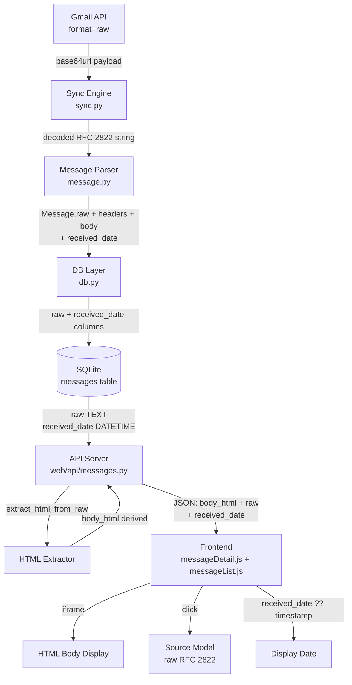

# Design Document: raw-message-source

## Overview

This feature replaces the `body_html` column in the `messages` table with a `raw` column that stores the complete RFC 2822 email source. The Gmail API's `format=raw` endpoint returns the full email — all transport headers plus the complete MIME body — as a base64url-encoded string. Storing this verbatim preserves all information that was previously discarded during sync.

A `received_date` column is also added to the `messages` table. It stores the datetime parsed from the last `Received:` header in the raw source (the final delivery hop), falling back to the last `X-Received:` header if needed. This is more reliable than the sender-supplied `Date:` header and is used as the primary display date throughout the UI.

The HTML body shown in the UI is derived on-the-fly from the stored raw source at API response time using a new `extract_html_from_raw` function. This eliminates the need to re-sync messages when the HTML extraction logic changes. A "View source" link is added to the message detail panel, opening a scrollable monospace modal that displays the full RFC 2822 source.

### Key Design Decisions

**Why store raw instead of body_html?**  
The `format=full` Gmail API response only returns the MIME payload tree, not transport headers (`Received`, `DKIM-Signature`, `Return-Path`, etc.). Storing `format=raw` preserves the complete email provenance and allows re-extraction of any field without re-syncing from Gmail.

**Why derive HTML on-the-fly at API response time?**  
Storing derived HTML couples the database to a specific extraction algorithm. If the extraction logic is improved, all messages would need re-syncing. Deriving at response time means improvements are immediately available for all stored messages.

**Why not store both raw and body_html?**  
Redundant storage wastes disk space and creates a consistency problem (which is authoritative?). The raw source is the single source of truth; body_html is always a derived view.

**Why use the last `Received:` header for received_date?**  
RFC 2822 messages accumulate `Received:` headers as they hop between servers — each server prepends its own. The last header in the list is therefore the one added by the final delivery server (the one closest to the recipient's mailbox), which is the most meaningful "when did I actually get this" timestamp. The `Date:` header is set by the sender and can be wrong, spoofed, or in the wrong timezone.

---

## Architecture



The data flow is strictly one-directional: raw source flows from Gmail → sync → DB → API → frontend. The HTML extraction is a pure function applied at the API layer, with no feedback loop back to the database.

---

## Components and Interfaces

### 1. Schema Migration v5 (`gmail_to_sqlite/schema_migrations/v5_rename_body_html_to_raw.py`)

Handles all possible database states for both the `raw` and `received_date` columns:

| State | Action |
|---|---|
| `body_html` exists, `raw` does not | `ALTER TABLE messages RENAME COLUMN body_html TO raw` |
| `raw` already exists | No-op for raw column |
| Neither `body_html` nor `raw` exists | `ALTER TABLE messages ADD COLUMN raw TEXT` |
| `received_date` does not exist | `ALTER TABLE messages ADD COLUMN received_date DATETIME` |
| `received_date` already exists | No-op for received_date column |

SQLite's `RENAME COLUMN` (available since SQLite 3.25.0, released 2018) preserves all row data in-place. Both operations are guarded with `column_exists()` checks from the existing migrations helper.

### 2. Migration Runner (`gmail_to_sqlite/migrations.py`)

Adds a new `if current_version == 4:` block following the existing sequential pattern:

```python
if current_version == 4:
    logger.info("Running migration v5: rename body_html to raw")
    from .schema_migrations.v5_rename_body_html_to_raw import run as run_v5
    if run_v5():
        if set_schema_version(5):
            current_version = 5
        else:
            return False
    else:
        return False
```

The final `if current_version >= 4:` idle-log block is updated to `>= 5`.

### 3. Message Parser (`gmail_to_sqlite/message.py`)

**Changes to `Message` class:**
- Remove `body_html` attribute; add `raw: Optional[str] = None`
- Add `received_date: Optional[datetime] = None`
- Replace `_extract_html_body` + `_extract_body` logic with parsing from the raw RFC 2822 string using Python's `email` stdlib
- `parse()` now accepts a decoded RFC 2822 string (passed from the sync engine) rather than a Gmail API payload dict

**`received_date` extraction algorithm:**

```python
def _parse_received_date(parsed_email) -> Optional[datetime]:
    """
    Extract received_date from the last Received: header, falling back
    to the last X-Received: header.

    Received headers are prepended by each hop, so the last one in the
    list is the final delivery server (closest to the recipient's mailbox).

    Header format example:
      Received: by 2002:a05:6214:2582:b0:88a:3657:d3e2 with SMTP id
                fq2csp778250qvb; Sat, 31 Jan 2026 05:37:01 -0800 (PST)

    The date is the substring after the final semicolon (;).
    """
    for header_name in ("received", "x-received"):
        values = parsed_email.get_all(header_name) or []
        # get_all() returns in header order (top to bottom);
        # last element = last Received: = final delivery hop
        for value in reversed(values):
            if ";" in value:
                date_str = value.rsplit(";", 1)[-1].strip()
                try:
                    return parsedate_to_datetime(date_str)
                except Exception:
                    logger.debug(
                        f"Could not parse date from {header_name}: {date_str!r}"
                    )
                    continue
    return None
```

**New module-level function:**
```python
def extract_html_from_raw(raw: str) -> Optional[str]:
    """
    Extract the text/html MIME part from a decoded RFC 2822 string.
    Returns None if raw is None/empty or no text/html part exists.
    """
```

**HTML stripping helper** (inline within `extract_html_from_raw` or as a private helper):
```python
def _strip_to_html_tag(html: str) -> Optional[str]:
    """
    If html contains '<html', return the substring from '<html' onward.
    Otherwise return html unchanged. Returns None for None/empty input.
    """
```

### 4. Sync Engine (`gmail_to_sqlite/sync.py`)

**`_fetch_message` changes:**
- Add `format='raw'` to the `service.users().messages().get()` call
- After receiving the response, decode `raw_msg['raw']` from base64url to a UTF-8 string
- Pass the decoded string to `Message.from_raw_source(decoded_str, labels)` (new factory method) instead of `Message.from_raw(raw_msg, labels)`

**`all_messages` changes:**
- Replace `db.get_message_ids_missing_html()` with `db.get_message_ids_missing_raw()`
- Update the log message accordingly

**Error handling:**
- If `raw_msg` has no `'raw'` key: log a warning, set `msg.raw = None`, continue
- If base64url decode fails: log the error, set `msg.raw = None`, continue (do not abort the whole sync)

### 5. DB Layer (`gmail_to_sqlite/db.py`)

**`Message` ORM model:**
- Remove `body_html = TextField(null=True)`
- Add `raw = TextField(null=True)`
- Add `received_date = DateTimeField(null=True)`

**`create_message`:**
- Replace `body_html=msg.body_html` with `raw=msg.raw` in both the `insert()` and the `on_conflict(update={...})` dict
- Add `received_date=msg.received_date` to both the `insert()` and the `on_conflict(update={...})` dict

**`get_message_ids_missing_raw`** (replaces `get_message_ids_missing_html`):
```python
def get_message_ids_missing_raw() -> List[str]:
    """Returns message IDs where the raw column is NULL."""
```

### 6. API Server (`web/api/messages.py`)

**`SUMMARY_FIELDS` tuple:**
- Add `'received_date'` so it is returned in the message list (used by the frontend for display date)

**`DETAIL_FIELDS` tuple:**
- Remove `'body_html'`
- Add `'raw'`
- `'received_date'` is already included via `SUMMARY_FIELDS`

**`get_message` handler:**
- After fetching the row, call `extract_html_from_raw(row['raw'])` to derive `body_html`
- Apply the existing CID rewriter to the derived `body_html`
- Include `body_html` (derived), `raw`, and `received_date` in the JSON response

```python
from gmail_to_sqlite.message import extract_html_from_raw

# Inside get_message():
raw_source = msg_dict.get("raw") or ""
body_html = extract_html_from_raw(raw_source)
if body_html:
    body_html = re.sub(
        r'cid:([^\s"\'>\)]+)',
        lambda m: f'/api/cid/{m.group(1)}?msg={message_id}',
        body_html
    )
msg_dict["body_html"] = body_html
```

The `raw` and `received_date` fields are already in `msg_dict` from the DB query and are passed through to the response unchanged.

### 7. Frontend (`web/static/messageDetail.js` and `web/static/messageList.js`)

**Display date helper** (shared logic, can be a module-level function in `messageDetail.js`):
```javascript
/**
 * Returns the best available display date for a message.
 * Prefers received_date; falls back to timestamp.
 */
function getDisplayDate(msg) {
  return msg.received_date || msg.timestamp;
}
```

**`messageList.js` changes:**
- Replace `msg.timestamp` with `getDisplayDate(msg)` (or inline equivalent) when rendering the date column in the message list table

**`messageDetail.js` — `render()` function additions:**
- Replace the "Date:" meta line with conditional logic:
  - If `msg.received_date` is non-null: label "Received:" and use `msg.received_date`
  - Otherwise: label "Date:" and use `msg.timestamp` (existing behaviour)
- After the Gmail link, conditionally render a "View source" link if `msg.raw` is non-null
- The link calls `openSourceModal(msg.raw)`

**New `openSourceModal(rawSource)` function:**
- Follows the same pattern as `openAttachmentPreview`
- Creates a full-screen overlay with a white modal card
- Header: title "Message Source" + close button (✕)
- Body: `<pre>` element with `font-family: monospace`, `white-space: pre`, `overflow: auto`, containing the raw source as escaped text
- Closes on: close button click, Escape key, backdrop click

**No changes to `renderBody`** — it continues to use `msg.body_html` which is now derived server-side.

---

## Data Models

### `messages` table (after v5 migration)

| Column | Type | Notes |
|---|---|---|
| `message_id` | TEXT UNIQUE | Gmail message ID |
| `thread_id` | TEXT | Gmail thread ID |
| `sender` | JSON | `{name, email}` |
| `recipients` | JSON | `{to, cc, bcc}` arrays |
| `labels` | JSON | Array of label name strings |
| `subject` | TEXT NULL | Email subject |
| `body` | TEXT NULL | Plain-text body (for search) |
| `raw` | TEXT NULL | **New** — full RFC 2822 source (replaces `body_html`) |
| `received_date` | DATETIME NULL | **New** — parsed from last `Received:` header; fallback to last `X-Received:` |
| `size` | INTEGER | Size estimate in bytes |
| `timestamp` | DATETIME | Gmail internal ingest time (unchanged) |
| `is_read` | BOOLEAN | Read status |
| `is_outgoing` | BOOLEAN | Sent by user |
| `is_deleted` | BOOLEAN | Soft-deleted flag |
| `last_indexed` | DATETIME | Last sync timestamp |

### `Message` Python object (after changes)

```python
@dataclass
class Message:
    id: Optional[str]
    thread_id: Optional[str]
    sender: Dict[str, str]
    recipients: Dict[str, List[Dict[str, str]]]
    labels: List[str]
    subject: Optional[str]
    body: Optional[str]                  # plain-text, for search
    raw: Optional[str]                   # full RFC 2822 source (replaces body_html)
    received_date: Optional[datetime]    # parsed from last Received: header
    size: int
    timestamp: Optional[datetime]        # Gmail internalDate (unchanged)
    is_read: bool
    is_outgoing: bool
    attachments: List[Attachment]
```

### API Response shape for `GET /api/messages`

```json
{
  "messages": [{
    "message_id": "...",
    "subject": "...",
    "sender": {"name": "...", "email": "..."},
    "labels": [...],
    "timestamp": "...",
    "received_date": "...",   // null if not yet synced or not parseable
    "is_read": true,
    "is_outgoing": false,
    "is_deleted": false,
    "has_attachments": false
  }],
  "total": 124347,
  "page": 1,
  "page_size": 50
}
```

### API Response shape for `GET /api/messages/<id>`

```json
{
  "message_id": "...",
  "thread_id": "...",
  "sender": {"name": "...", "email": "..."},
  "recipients": {"to": [...], "cc": [...], "bcc": [...]},
  "labels": [...],
  "subject": "...",
  "body": "...",
  "body_html": "...",        // derived on-the-fly from raw; null if raw is null
  "raw": "...",              // full RFC 2822 source; null if not yet synced
  "timestamp": "...",        // Gmail internalDate
  "received_date": "...",    // from last Received: header; null if absent/unparseable
  "is_read": true,
  "is_outgoing": false,
  "is_deleted": false,
  "attachments": [...]
}
```

---

## Correctness Properties

*A property is a characteristic or behavior that should hold true across all valid executions of a system — essentially, a formal statement about what the system should do. Properties serve as the bridge between human-readable specifications and machine-verifiable correctness guarantees.*

This feature is well-suited for property-based testing. The core operations — base64url decoding, RFC 2822 parsing, HTML extraction, HTML stripping, and database round-trips — are pure functions whose correctness should hold across a wide range of inputs. The project already uses Hypothesis for property-based testing.

**Property Reflection:**

After reviewing all testable criteria, the following consolidations apply:
- Requirements 3.2 and 3.4 (header extraction and raw attribute preservation) can be combined into a single "parse round-trip" property since both are verified by parsing a generated message and checking the output.
- Requirements 4.2 and 4.6 (HTML extraction and equivalence with old method) are closely related but test different things: 4.2 tests the new function in isolation, 4.6 tests equivalence with the old path. These remain separate.
- Requirements 9.1 and 9.2 (DB write and upsert) can be combined into a single "DB round-trip" property.
- Requirements 6.1 and 6.2 (HTML stripping with and without `<html` tag) can be combined into one property about stripping behavior.

---

### Property 1: Migration data preservation

*For any* set of messages stored in the `body_html` column before the v5 migration runs, after the migration completes the same data SHALL be present in the `raw` column with no rows lost or modified.

**Validates: Requirements 1.3**

---

### Property 2: Migration idempotence

*For any* database state where the `raw` column already exists, running the v5 migration a second time SHALL return `True` and leave all row data unchanged.

**Validates: Requirements 1.4**

---

### Property 3: Base64url decode round-trip

*For any* UTF-8 string, base64url-encoding it and then applying the sync engine's decode path SHALL produce a string equal to the original.

**Validates: Requirements 2.2**

---

### Property 4: Message parse preserves raw, headers, and received_date

*For any* valid RFC 2822 string containing `From`, `To`, `Subject`, `Date`, and at least one `Received:` header with a semicolon-delimited date, parsing it with `Message.from_raw_source` SHALL produce a `Message` object where:
- `msg.raw` equals the input string
- all extracted header fields match the values present in the input
- `msg.received_date` equals the datetime parsed from the last `Received:` header's date portion

**Validates: Requirements 3.2, 3.4, 3.7**

---

### Property 5: HTML extraction round-trip

*For any* HTML string embedded as the `text/html` part of a valid RFC 2822 multipart message, calling `extract_html_from_raw` on that message SHALL return a string equal to the original HTML content.

**Validates: Requirements 4.2**

---

### Property 6: HTML extraction equivalence with old method

*For any* valid RFC 2822 string that contains a `text/html` part, the HTML returned by `extract_html_from_raw` SHALL be identical to the HTML that would have been returned by the previous `_extract_html_body` method operating on the equivalent `format=full` Gmail API payload.

**Validates: Requirements 4.6**

---

### Property 7: HTML stripping correctness

*For any* HTML string, applying the `_strip_to_html_tag` helper SHALL return a string that starts with `<html` if the input contains `<html`, or return the input unchanged if it does not contain `<html`.

**Validates: Requirements 6.1, 6.2**

---

### Property 8: API response body_html derivation

*For any* message stored in the database with a non-null `raw` value, the `body_html` field in the `GET /api/messages/<id>` response SHALL equal `extract_html_from_raw(raw)` after CID rewriting is applied.

**Validates: Requirements 5.2, 5.4**

---

### Property 9: DB raw and received_date round-trip

*For any* `Message` object with a `raw` attribute and a `received_date` attribute (each independently `None` or a value), calling `create_message` and then querying the database SHALL return the same `raw` and `received_date` values. When called again with different values (upsert), the stored values SHALL be updated.

**Validates: Requirements 9.1, 9.2, 9.3, 9.4, 9.5, 9.6**

---

### Property 10: get_message_ids_missing_raw completeness

*For any* set of messages in the database where some have `raw = NULL` and others have `raw` set to a non-null string, `get_message_ids_missing_raw()` SHALL return exactly the IDs of messages with `NULL` raw — no more, no fewer.

**Validates: Requirements 10.1**

---

### Property 11: View source link presence

*For any* message object where `msg.raw` is a non-null, non-empty string, rendering the detail panel SHALL produce a DOM element containing a "View source" link. *For any* message object where `msg.raw` is `null` or absent, no such link SHALL appear.

**Validates: Requirements 7.1, 7.2**

---

### Property 12: Source modal displays raw content

*For any* raw RFC 2822 string, opening the Source_Modal with that string SHALL produce a `<pre>` element whose text content equals the raw string.

**Validates: Requirements 8.1**

---

### Property 13: received_date extraction — last Received header used

*For any* RFC 2822 string containing multiple `Received:` headers each with a valid semicolon-delimited date, `_parse_received_date` SHALL return the datetime from the **last** `Received:` header in document order, not the first.

**Validates: Requirements 3.7**

---

### Property 14: received_date fallback to X-Received

*For any* RFC 2822 string with no parseable `Received:` header but at least one `X-Received:` header with a valid date, `_parse_received_date` SHALL return the datetime from the last `X-Received:` header.

**Validates: Requirements 3.7**

---

### Property 15: Display date uses received_date when available

*For any* message object where `received_date` is non-null, `getDisplayDate(msg)` SHALL return `received_date`. *For any* message object where `received_date` is null, `getDisplayDate(msg)` SHALL return `timestamp`.

**Validates: Requirements 12.1, 12.2**

---

## Error Handling

### Sync Engine

| Scenario | Handling |
|---|---|
| Gmail API returns no `raw` field | Log warning at `WARNING` level; set `msg.raw = None`; continue sync |
| base64url decode raises exception | Log error with message ID; set `msg.raw = None`; continue sync |
| Gmail API HTTP 5xx on fetch | Existing retry logic (up to `MAX_RETRY_ATTEMPTS`) applies unchanged |
| Gmail API HTTP 4xx (e.g. 404) | Existing error handling applies; message skipped |

### Message Parser

| Scenario | Handling |
|---|---|
| `email.message_from_string` raises | Raise `MessageParsingError` with descriptive message |
| No `text/plain` part found | Fall back to `html2text` on `text/html` part |
| No `text/plain` or `text/html` part | `msg.body = None` |
| `extract_html_from_raw(None)` | Return `None` immediately |
| `extract_html_from_raw("")` | Return `None` immediately |
| No `Received:` headers present | Try `X-Received:` fallback |
| No `Received:` or `X-Received:` headers | `msg.received_date = None` |
| Date substring after `;` fails to parse | Log debug warning; try next header in fallback chain |
| `Received:` header has no `;` | Skip that header; try next one |

### Migration Runner

| Scenario | Handling |
|---|---|
| `RENAME COLUMN` fails (SQLite < 3.25) | Catch exception, log error, return `False` |
| `ADD COLUMN` fails | Catch exception, log error, return `False` |
| `set_schema_version` fails after successful migration | Log error, return `False` (migration will re-run on next startup — idempotent) |

### API Server

| Scenario | Handling |
|---|---|
| `raw` is `NULL` in DB | Return `body_html: null`, `raw: null` in response |
| `received_date` is `NULL` in DB | Return `received_date: null` in response |
| `extract_html_from_raw` raises | Catch, log, return `body_html: null` (do not 500) |
| Message not found | Existing 404 handling unchanged |

### Frontend

| Scenario | Handling |
|---|---|
| `msg.raw` is `null` or absent | "View source" link not rendered |
| `msg.received_date` is `null` | Fall back to `msg.timestamp` for display date; label as "Date:" |
| `msg.received_date` is non-null | Use as display date; label as "Received:" in detail panel |
| Source modal opened with empty string | Modal renders with empty `<pre>` |
| Escape key pressed | Modal removed from DOM, keydown listener cleaned up |

---

## Testing Strategy

### Unit Tests (example-based)

**Migration (`tests/test_v5_migration.py`):**
- Test rename from `body_html` to `raw` with existing data
- Test no-op when `raw` already exists
- Test add column when neither exists
- Test `received_date` column added when absent
- Test no-op when `received_date` already exists
- Test schema version is set to 5 after success
- Test `False` returned on simulated failure

**Message Parser (`tests/test_message.py`):**
- Test `extract_html_from_raw` with a known multipart message
- Test `extract_html_from_raw` returns `None` for plain-text-only message
- Test `extract_html_from_raw` returns `None` for `None` input
- Test `_strip_to_html_tag` with preamble before `<html`
- Test `_strip_to_html_tag` with no `<html` tag
- Test `Message.from_raw_source` extracts correct headers from a known RFC 2822 string
- Test fallback to `html2text` when no `text/plain` part
- Test `received_date` extracted from last `Received:` header (multiple headers present)
- Test `received_date` falls back to last `X-Received:` when no `Received:` is parseable
- Test `received_date` is `None` when neither header is present
- Test `received_date` is `None` when `Received:` header has no semicolon
- Test `received_date` is `None` when date substring after `;` is malformed

**API Server (`tests/test_api_messages.py`):**
- Test `GET /api/messages/<id>` returns `body_html` derived from `raw`
- Test `GET /api/messages/<id>` returns `raw: null` when raw is NULL
- Test `GET /api/messages/<id>` returns `received_date` when present
- Test `GET /api/messages/<id>` returns `received_date: null` when absent
- Test `GET /api/messages` includes `received_date` in summary rows
- Test CID rewriting is applied to derived `body_html`
- Test `DETAIL_FIELDS` contains `raw` and not `body_html`

**DB Layer (`tests/test_db.py`):**
- Test `get_message_ids_missing_raw` returns correct IDs
- Test `create_message` writes `raw` column
- Test `create_message` writes `received_date` column
- Test upsert updates both `raw` and `received_date` columns

**Frontend (`tests/test_messageDetail.js` — Jest or similar):**
- Test "View source" link rendered when `msg.raw` is non-null
- Test "View source" link absent when `msg.raw` is null
- Test Source_Modal opens on click
- Test Source_Modal closes on Escape
- Test Source_Modal closes on backdrop click
- Test Source_Modal `<pre>` contains the raw string
- Test detail panel shows "Received:" label when `msg.received_date` is non-null
- Test detail panel shows "Date:" label when `msg.received_date` is null
- Test message list uses `received_date` when non-null
- Test message list falls back to `timestamp` when `received_date` is null

### Property-Based Tests (Hypothesis)

The project uses [Hypothesis](https://hypothesis.readthedocs.io/) for property-based testing. Each property test runs a minimum of 100 iterations.

**`tests/test_raw_message_source_properties.py`:**

```python
# Feature: raw-message-source, Property 3: Base64url decode round-trip
@given(st.text())
@settings(max_examples=200)
def test_base64url_decode_roundtrip(raw_text): ...

# Feature: raw-message-source, Property 4: Message parse preserves raw, headers, and received_date
@given(rfc2822_message_strategy())
@settings(max_examples=100)
def test_parse_preserves_raw_headers_and_received_date(rfc2822_str): ...

# Feature: raw-message-source, Property 5: HTML extraction round-trip
@given(html_content_strategy())
@settings(max_examples=100)
def test_html_extraction_roundtrip(html_str): ...

# Feature: raw-message-source, Property 7: HTML stripping correctness
@given(st.text(), st.text())
@settings(max_examples=200)
def test_html_stripping(preamble, html_body): ...

# Feature: raw-message-source, Property 9: DB raw and received_date round-trip
@given(st.one_of(st.none(), st.text()), st.one_of(st.none(), st.datetimes()))
@settings(max_examples=100)
def test_db_raw_and_received_date_roundtrip(raw_value, received_date): ...

# Feature: raw-message-source, Property 10: get_message_ids_missing_raw completeness
@given(st.lists(st.one_of(st.none(), st.text(min_size=1))))
@settings(max_examples=100)
def test_missing_raw_completeness(raw_values): ...

# Feature: raw-message-source, Property 13: received_date uses last Received header
@given(st.lists(st.datetimes(), min_size=2, max_size=5))
@settings(max_examples=100)
def test_received_date_uses_last_header(dates): ...

# Feature: raw-message-source, Property 14: received_date fallback to X-Received
@given(st.datetimes())
@settings(max_examples=100)
def test_received_date_fallback_to_x_received(date): ...

# Feature: raw-message-source, Property 15: Display date uses received_date when available
@given(st.one_of(st.none(), st.text(min_size=1)), st.text(min_size=1))
@settings(max_examples=200)
def test_display_date_prefers_received_date(received_date, timestamp): ...
```

**Hypothesis strategies needed:**
- `rfc2822_message_strategy()`: generates valid RFC 2822 strings with random headers and MIME parts
- `html_content_strategy()`: generates HTML strings (can use `st.text()` with HTML-like structure or a dedicated strategy)

### Integration Tests

- End-to-end sync test with a mocked Gmail API returning `format=raw` responses
- Verify the full pipeline: mock API → sync → DB → API endpoint → JSON response contains correct `body_html`

### Test Configuration

Property tests are tagged with comments in the format:
```
# Feature: raw-message-source, Property N: <property_text>
```

Each property test uses `@settings(max_examples=100)` minimum (200 for simpler properties like string round-trips).
